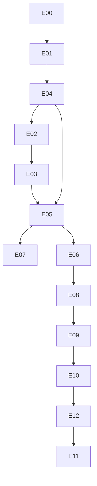

# Dependency Graph (acyclic)

```mermaid
flowchart TB
  E00 --> E01 --> E04
  E04 --> E02 --> E03 --> E05 --> E07
  E04 --> E05
  E05 --> E06 --> E08 --> E09
  E09 --> E10 --> E12 --> E11
```
- P0 chain: E00→E01→E04→E06→E08→E09→E11 gates.
- E02/E03 require VERIFY Toobit docs. E06 blocks E08/E09 execution work. No cycles (checked in audit).
